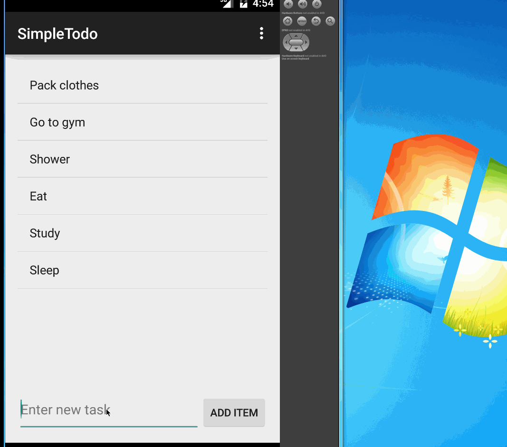

# SimpleToDo
My first repository on GitHub

# SimpleToDo
My first repository on GitHub
This is a simple android app creating a todo list.

User can
* [x] add new item on the list
* [x] remove unwanted item
* [x] and modify an item and save to the list.

Walkthrough of all user stories:

GIF created with [LiceCap](http://www.cockos.com/licecap/).